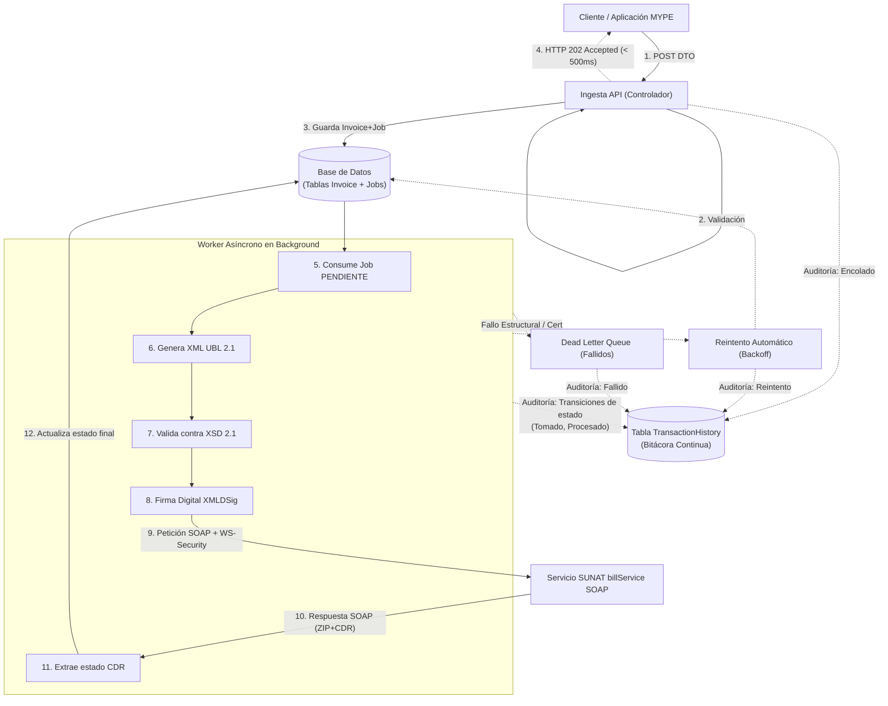

# Especificación Técnica: Pipeline de Emisión y Resiliencia

## 1. Propósito y Alcance

### 1.1. Propósito del Documento
El propósito de este documento es establecer la especificación técnica del flujo de ejecución correspondiente al **Pipeline de Emisión y Seguridad SUNAT** (Módulo de Facturación). 

Alineado con los objetivos del *Project Charter*, este diseño aborda directamente la necesidad de las MYPEs de mantener la consistencia de sus operaciones comerciales ante interrupciones de red o fallos en los servicios tributarios externos. La arquitectura documentada aquí garantiza:
- **Alta Resiliencia:** Procesamiento asíncrono y recuperación automática ante la indisponibilidad temporal del servicio `billService` de SUNAT (Objetivo 2 del Charter).
- **Rendimiento:** Procesamiento acelerado minimizando la latencia local de respuesta hacia el cliente (≤ 500 ms por operación en ingesta).
- **Trazabilidad:** Registro completo de auditoría para cada intento de envío, observación o rechazo.

### 1.2. Alcance del Pipeline
Este documento cubre exclusivamente el ciclo de vida técnico del comprobante desde que ingresa a nuestro sistema local hasta que obtiene un estado final por parte de SUNAT.

**Dentro del Alcance:**
*   Recepción y validación estructural del comprobante vía DTO (`CreateInvoiceDto`).
*   Desacoplamiento del guardado y envío mediante el patrón **Transactional Outbox**.
*   Procesamiento asíncrono a través de Workers.
*   Transformación de datos al estándar **XML UBL 2.1** y Firma Digital (XMLDSig) con certificados X.509.
*   Comunicación SOAP con autenticación WS-Security.
*   Extracción y persistencia del estado final a partir del archivo de Constancia de Recepción (CDR) devuelto en Base64/ZIP.
*   Mecanismos de reintento, colas de fallidos (Dead Letter Queue) y auditoría en `TransactionHistory`.

**Fuera del Alcance (Exclusiones):**
*   **Ajenos al proyecto:** Modificación o control sobre el funcionamiento interno de los servicios oficiales de SUNAT. (Para la validación local de escenarios anómalos se emplea un servidor Mock propio, según las tareas TA-06 y TA-12).
*   **Diferidos a módulos futuros:** Generación de representaciones impresas visuales del comprobante (archivos PDF).
*   **Diferidos a módulos futuros:** Reglas de conciliación contable cruzada con el SIRE y procesamiento de archivos TXT del PLE (estos pertenecen al *Módulo de conciliación automatizada* descrito en el Project Charter, no al pipeline de emisión).

## 2. Arquitectura del Pipeline y Patrones de Diseño

Para cumplir con las métricas de latencia estricta (≤ 500 ms) y alta tolerancia a fallos, el pipeline se ha diseñado desacoplando la **recepción** del comprobante de su **procesamiento y envío**.

### 2.1. Diagrama de Flujo (Mermaid)

El siguiente diagrama ilustra el flujo de datos completo, desde la petición HTTP inicial hasta la auditoría de la respuesta de SUNAT.

El diagrama expuesto ilustra una **arquitectura basada en colas de tareas (Task Queue Architecture)**, fuertemente enfocada en el desacoplamiento de procesos. La interacción de la MYPE (el sistema cliente) se mantiene exclusivamente en el plano síncrono, asegurando una latencia mínima de respuesta al delegar toda la carga computacional pesada —como la transformación UBL, la firma criptográfica y la comunicación SOAP— a un *Worker* operando en segundo plano mediante un gestor de colas.

Asimismo, el diseño introduce barreras de contención robustas ante imprevistos. El uso central de la base de datos como mediador (*Transactional Outbox*) previene la pérdida de facturas, mientras que el flujo asíncrono categoriza inteligentemente los errores: los fallos de red de SUNAT disparan reintentos automáticos programados, y los errores irreversibles (como un esquema XML inválido) se aíslan en colas de fallidos (DLQ) para no detener ni afectar la emisión del resto de los comprobantes del negocio.

### 2.2. Justificación de Patrones Arquitectónicos y Buenas Prácticas

El diseño de este pipeline no es casual; responde directamente a los desafíos de integración en sistemas distribuidos y a las restricciones planteadas en el *Project Charter* (latencias mínimas y tolerancia a fallos externos). Se han aplicado las siguientes buenas prácticas y patrones de ingeniería de software:

#### A. Patrón *Transactional Outbox* (Prevención del "Dual-Write Problem")
En arquitecturas tradicionales, el sistema suele realizar dos escrituras distintas de forma secuencial: guardar el comprobante en la base de datos y luego enviar un mensaje a una cola de procesamiento. Si la primera acción triunfa pero la segunda falla (por un microcorte de red), el sistema queda en un estado inconsistente, generando datos huérfanos.

Para solucionar esto, el patrón *Transactional Outbox* obliga a que la creación del comprobante en la tabla `Invoice` y la creación de la tarea en el Outbox se realicen dentro de una **única transacción ACID** de la base de datos. De este modo, se garantiza la atomicidad de la operación: o todo se guarda, o todo falla y se hace *rollback*. Esto asegura que el sistema jamás pierda el rastro de una factura que ingresó, logrando una **consistencia eventual** perfecta sin la sobrecarga operativa de implementar un *Two-Phase Commit* (2PC).

#### B. Desacoplamiento mediante Procesamiento Asíncrono (*Background Workers*)
Las operaciones criptográficas (como la firma digital XMLDSig) y la llamada HTTP/SOAP hacia SUNAT son operaciones de entrada/salida (I/O) bloqueantes con tiempos de respuesta impredecibles. Si la API realizara esto de forma síncrona, se rompería la métrica de latencia establecida en el *Project Charter* (≤ 500 ms).

La solución adoptada consiste en separar las responsabilidades (*Separation of Concerns*). La API transaccional delega las tareas pesadas: solo guarda el comprobante y responde inmediatamente al cliente con un estado HTTP `202 Accepted`. Un *Worker* en segundo plano consume la cola a su propio ritmo. Este diseño no solo protege la experiencia del usuario final, sino que permite **escalabilidad horizontal**; si el volumen de facturación aumenta a fin de mes, se pueden instanciar múltiples workers sin afectar el rendimiento de la API principal.

#### C. Tolerancia a Fallos: *Exponential Backoff* y *Dead Letter Queue* (DLQ)
Frente a un fallo en el envío, reintentar ciegamente a máxima velocidad puede provocar un ataque de denegación de servicio (DDoS) a SUNAT o al propio sistema. Para evitar esto, el manejo de errores se categoriza en dos vías, aislando el fallo (*Fault Isolation*):

1.  **Fallos Transitorios (Ej. HTTP 503, Timeout):** Se aplica un mecanismo de reintento automatizado utilizando **Exponential Backoff**, es decir, esperando más tiempo tras cada fallo sucesivo (ej. 1s, 2s, 4s). Esto previene el problema del "Thundering Herd" (rebaño en estampida) cuando el servicio SUNAT vuelve a estar en línea.
2.  **Fallos Permanentes / Deterministas (Ej. Rechazo XSD, Certificado Vencido):** El Worker aborta la ejecución inmediatamente y envía la tarea a una **Dead Letter Queue (Cola de Fallidos)**. Esto permite registrar exhaustivamente el error para su intervención manual, liberando inmediatamente al Worker para que continúe procesando facturas sanas sin atascar la cola.

#### D. Trazabilidad Continua (*Append-only Log*)
El sistema no audita el estado de una factura únicamente al finalizar el proceso, sino que implementa una bitácora continua. La tabla `TransactionHistory` actúa como un *append-only log* inmutable: cada transición de estado del Worker (encolado, tomado, procesado, fallido o reintento) inserta una nueva fila. Este patrón de trazabilidad asegura que ante una anomalía, el equipo técnico pueda reconstruir la línea de tiempo exacta del ciclo de vida del comprobante (MTTD reducido), cumpliendo así con las estrictas exigencias de control tributario.

## 3. Descripción Detallada de Componentes

A continuación, se desglosa la responsabilidad técnica de cada componente involucrado en el flujo de emisión descrito en el diagrama anterior.

### 3.1. Ingesta y Validación Inicial (Controlador)
El punto de entrada del sistema se expone a través del endpoint `POST /api/v1/invoices`. Este controlador se encarga de recibir el payload JSON enviado por el cliente y transformarlo internamente en un Data Transfer Object (`CreateInvoiceDto`). Inmediatamente, ejecuta una validación rápida y síncrona para asegurar la presencia de campos obligatorios, formatos correctos y montos lógicos (cubriendo la Tarea HU-02). Si la petición está mal formada, el sistema la rechaza preventivamente con un `HTTP 400 Bad Request`, evitando que información basura contamine las colas de procesamiento. Si el DTO es válido, la responsabilidad se transfiere a la capa de servicio.

### 3.2. Persistencia Transaccional (Supabase / PostgreSQL)
La base de datos funciona como el mediador central seguro entre el mundo síncrono de la API y el procesamiento asíncrono. Al recibir un DTO válido, el sistema inserta el comprobante en la tabla `Invoice` con un estado `PENDIENTE` y, simultáneamente, registra el trabajo en el gestor de colas. Ambas acciones se ejecutan bajo una única transacción de base de datos. Una vez confirmada la transacción, se emite inmediatamente un log inicial a la tabla `TransactionHistory` indicando el evento de encolado y se libera la petición respondiendo al cliente con un `HTTP 202 Accepted`.

### 3.3. Worker de Generación y Validación (UBL 2.1)
El motor principal del procesamiento recae en un *Worker* asíncrono, encargado de la lógica central del negocio (Tarea HU-04). Al extraer una tarea de la base de datos, el Worker registra el evento correspondiente en la auditoría y procede a convertir los datos abstractos de la factura al formato estructurado y estandarizado **XML UBL 2.1**. Antes de continuar, el Worker realiza una validación estructural estricta contra el esquema XSD 2.1 oficial de SUNAT (Tarea TA-09). Si el documento no cumple con el esquema, el proceso se aborta de inmediato y el Job se desvía a la cola de fallidos (DLQ).

### 3.4. Módulo de Seguridad y Firma Digital (XMLDSig)
Para otorgar validez legal al comprobante XML generado, el sistema emplea el certificado digital de la MYPE (archivo PFX/X.509 configurado de manera segura en el entorno, según la Tarea TA-04). El módulo criptográfico calcula el *Hash* (Digest) del documento y estampa el nodo `<ds:Signature>` correspondiente. Esta firma digitalizada garantiza la integridad del contenido y el principio de no repudio exigido por la normativa tributaria (Tarea TA-07).

### 3.5. Cliente SOAP y WS-Security
Una vez que el comprobante está firmado y validado, debe ser transmitido a SUNAT (Tareas TA-03 y TA-05). El sistema codifica el XML firmado a formato Base64, lo empaqueta dentro de un sobre SOAP estándar y le inyecta las credenciales SOL de la empresa en el encabezado `WS-Security` (mediante un UsernameToken). Posteriormente, abre una conexión HTTP hacia el servicio `billService` (el cual, dependiendo de las variables de entorno, apuntará a los servidores oficiales de SUNAT o al **servidor Mock interno** para desarrollo y pruebas). Es en esta capa de red donde actúan las políticas de tolerancia a fallos, como el control de *Timeouts* y los reintentos automáticos (*Exponential Backoff*).

### 3.6. Parseo de Constancia de Recepción (CDR)
Tras el envío exitoso, el sistema debe interpretar la respuesta oficial emitida por SUNAT. El Worker recibe la respuesta SOAP, la desempaqueta y extrae el archivo ZIP cifrado en Base64. Tras descomprimirlo en memoria, procesa el archivo XML interno (la Constancia de Recepción o CDR), identificando el código de respuesta oficial (por ejemplo, el código `0` que indica aceptación) y extrayendo cualquier observación o advertencia adjunta.

### 3.7. Actualización Final de Estado
Como último paso del flujo, el sistema debe reflejar el resultado definitivo de la operación. El Worker actualiza el estado de la fila correspondiente en la tabla `Invoice`, marcándola como `ACEPTADO` o `RECHAZADO` según la respuesta del CDR. Finalmente, el ciclo de vida del Job se cierra registrando el evento "Procesado" en la tabla `TransactionHistory`, completando así la trazabilidad de la operación.

## 4. Matriz de Riesgos, Puntos de Fallo y Resiliencia

El diseño asíncrono tiene como principal objetivo asegurar la continuidad del negocio de la MYPE, garantizando que el sistema pueda tolerar y recuperarse ante fallos de infraestructura o caídas en los servicios tributarios. A continuación, se presenta la matriz formal de resiliencia:

| Componente | Punto de Fallo / Riesgo | Naturaleza | Estrategia de Mitigación (Resiliencia) | Mecanismo de Recuperación |
| :--- | :--- | :--- | :--- | :--- |
| **API / Controlador** | Cliente envía un payload con datos incompletos o mal formados. | Permanente | Validación síncrona temprana (DTO). Rechazo inmediato con `HTTP 400 Bad Request`. | Corrección requerida por parte de la MYPE o del sistema cliente antes de reintentar. |
| **Base de Datos** | Microcorte de conexión al momento de guardar la factura. | Transitoria | Transacciones ACID (*Transactional Outbox*). | Ambos guardados (Invoice y Job) fallan. El cliente recibe `HTTP 500` y puede reintentar sin generar datos huérfanos. |
| **Worker (Validación)** | El XML generado no cumple con el esquema XSD 2.1 oficial de SUNAT. | Permanente | Aborto inmediato de la tarea. Traslado del *Job* hacia la *Dead Letter Queue* (DLQ). | Intervención del equipo técnico para corregir el mapeo o los *builders* de XML UBL. |
| **Worker (Criptografía)** | Certificado digital (PFX/X.509) vencido, revocado o contraseña inválida. | Permanente | Captura de la excepción criptográfica. Traslado hacia la *Dead Letter Queue* (DLQ). | Renovación del certificado digital por parte de la MYPE y actualización en la configuración. |
| **Red (Cliente SOAP)** | El servicio oficial `billService` de SUNAT está caído o hay latencia extrema. | Transitoria | Política automatizada de reintentos mediante **Exponential Backoff** y *Timeouts* estrictos. | El sistema pausa y vuelve a intentar el envío periódicamente en segundo plano, siendo invisible para el usuario final. |
| **Respuesta SUNAT** | SUNAT rechaza la factura devolviendo un *SOAP Fault* (Regla de negocio inválida). | Permanente | Extracción del código y descripción del error. Marcado definitivo como `RECHAZADO` en BD. | Notificación al usuario final; la MYPE debe anular el comprobante o emitir uno nuevo corregido. |
| **Trazabilidad** | Pérdida de conocimiento sobre el estado de procesamiento de una factura encolada. | Mitigado | Registro inmutable de transiciones en la tabla de auditoría `TransactionHistory`. | Soporte técnico revisa el log continuo (MTTD reducido) para reconstruir el historial del comprobante. |

## 5. Configuración y Gestión de Entornos

Para garantizar que el pipeline se comporte de forma determinista y segura en distintas etapas de despliegue, el sistema aísla la configuración criptográfica y de red a través de variables de entorno estandarizadas.

### 5.1. Variables de Entorno Críticas (`.env`)
El comportamiento del Worker y del Cliente SOAP depende de la correcta inyección de credenciales. Bajo ninguna circunstancia esta información sensible debe estar versionada en el código fuente.

| Variable | Descripción y Propósito en el Pipeline |
| :--- | :--- |
| `DATABASE_URL` | Cadena de conexión JDBC/PostgreSQL. Vital para el patrón *Transactional Outbox* y la bitácora continua en `TransactionHistory`. Sin ella, el sistema no tiene persistencia resiliente. |
| `SUPABASE_URL` | URL del proyecto Supabase. Permite el enrutamiento base de los servicios gestionados por la plataforma. |
| `SUPABASE_KEY` | Clave anónima o de servicio (`anon_key` o `service_role_key`) para autenticar operaciones a nivel de API REST si fuesen necesarias. |
| `SUNAT_ENV` | Define el entorno de ejecución (`beta` para pruebas oficiales, `production` para emisión real). |
| `SUNAT_SOL_USER` | Usuario RUC+SOL proporcionado por SUNAT para autenticación vía `WS-Security`. |
| `SUNAT_SOL_PASS` | Clave secreta SOL asociada al usuario. |
| `CERT_BASE64` | Cadena en Base64 que contiene el certificado digital (`.PFX` / `X.509`) de la MYPE, necesario para firmar criptográficamente el nodo `<ds:Signature>`. |
| `CERT_PASSWORD` | Contraseña que desbloquea el certificado digital para la firma. |
| `SUNAT_BILL_SERVICE_URL` | URL destino del cliente SOAP. Durante la etapa de desarrollo, esta variable es clave ya que permite redirigir todo el tráfico saliente hacia el **Servidor Mock Interno**, evitando impactar la infraestructura gubernamental. |

### 5.2. Inventario de Pruebas y Fixtures
Para validar rigurosamente la matriz de resiliencia y el manejo asíncrono sin depender de la infraestructura externa, el equipo ha construido un conjunto de pruebas End-to-End (E2E) apalancadas por un Servidor Mock interno (TA-06 y TA-12). Este servidor intercepta las llamadas SOAP y responde con archivos XML estáticos predefinidos (*Fixtures*).

El inventario de respuestas controladas es el siguiente:

*   **`fixtures/sunat-cdr/0-accept.xml`**: Emula un escenario de "Camino Feliz". Retorna un Constancia de Recepción (CDR) empaquetado en ZIP con código `0` (Factura Aceptada), probando la extracción del XML interno y la actualización a `ACEPTADO`.
*   **`fixtures/sunat-cdr/1033-reject.xml`**: Emula un error determinista de regla de negocio (ej. comprobante duplicado o RUC no registrado). Se usa para probar el desvío inmediato del *Job* y la actualización de la factura a estado `RECHAZADO`.
*   **`fixtures/sunat-cdr/soap-fault.xml`**: Emula una interrupción del servicio o una caída abrupta del servidor gubernamental. Es vital para probar mecánicamente que las políticas de *Exponential Backoff* y reintentos se disparan correctamente sin perder la información.

## 6. Glosario y Referencias de Código

### 6.1. Glosario de Términos
*   **ACID (Atomicidad, Consistencia, Aislamiento, Durabilidad):** Conjunto de propiedades que garantizan que las transacciones en la base de datos se procesen de forma fiable (fundamental para el patrón *Outbox*).
*   **CDR (Constancia de Recepción):** Archivo XML oficial emitido por SUNAT que certifica la recepción y el estado de validación definitivo de un comprobante electrónico.
*   **Dead Letter Queue (DLQ):** Cola secundaria utilizada en sistemas asíncronos para aislar tareas que fallaron irreversiblemente (ej. XML inválido), evitando atascos en el flujo principal.
*   **DTO (Data Transfer Object):** Objeto utilizado para encapsular y transportar datos de forma segura entre el cliente HTTP y la API, validando su formato en el proceso.
*   **Exponential Backoff:** Algoritmo de resiliencia que incrementa progresivamente el tiempo de espera entre reintentos tras un fallo de red, evitando el colapso del servicio externo ("ataque" a SUNAT).
*   **MTTD (Mean Time To Detect):** Métrica que indica el tiempo promedio para detectar una anomalía. Se reduce significativamente gracias a la bitácora continua en `TransactionHistory`.
*   **SOAP Fault:** Elemento de respuesta estandarizado en el protocolo SOAP que la SUNAT utiliza para informar sobre un error en el procesamiento o en las reglas de negocio.
*   **Transactional Outbox:** Patrón de arquitectura que garantiza que el guardado de un registro (la factura) y la creación de su tarea de fondo (Job) ocurran en la misma transacción inquebrantable.
*   **UBL 2.1 (Universal Business Language):** Estándar XML de la industria promovido por OASIS y adoptado de forma obligatoria por SUNAT para estructurar documentos comerciales.
*   **XMLDSig:** Estándar de la W3C para firmar digitalmente nodos específicos dentro de un documento XML mediante certificados digitales.
*   **WS-Security:** Extensión del protocolo SOAP para aplicar seguridad en la capa de aplicación, incrustando credenciales (UsernameToken) directamente en el sobre XML.
*   **XSD (XML Schema Definition):** Lenguaje oficial que define estrictamente qué etiquetas, atributos y orden debe poseer un archivo XML para ser considerado válido por los servidores de la SUNAT antes del envío.

### 6.2. Referencias de Código para Sustentación (Capturas Sugeridas)
Para demostrar la implementación real de esta arquitectura ante el docente, se recomienda capturar los siguientes segmentos clave del código fuente:

1.  **Captura 1: El Controlador Síncrono (`invoices.controller.ts`)**
    *   El endpoint `POST /api/v1/invoices` y cómo retorna inmediatamente el estado `HTTP 202 Accepted` tras delegar la tarea.
2.  **Captura 2: El Patrón *Transactional Outbox***
    *   El fragmento de código (en el repositorio o servicio) donde se ejecuta la transacción ACID que guarda simultáneamente la factura y el *Job*.
3.  **Captura 3: El Controlador del Mock (`sunat-mock.controller.ts`)**
    *   El endpoint interno `/sunat-mock/billService` que intercepta la petición SOAP para devolver los *fixtures* en etapa de desarrollo.
4.  **Captura 4: Configuración Dinámica de Entornos (`.env`)**
    *   El archivo `.env` o la lógica que lee la variable `SUNAT_BILL_SERVICE_URL` para demostrar cómo el sistema decide si enviar los datos a la SUNAT real o al Mock.

---
